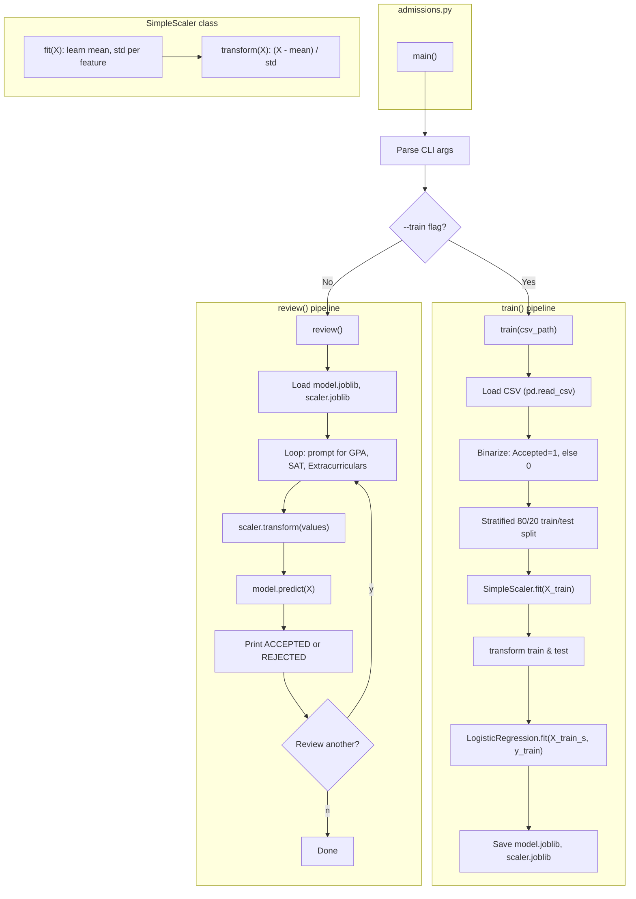
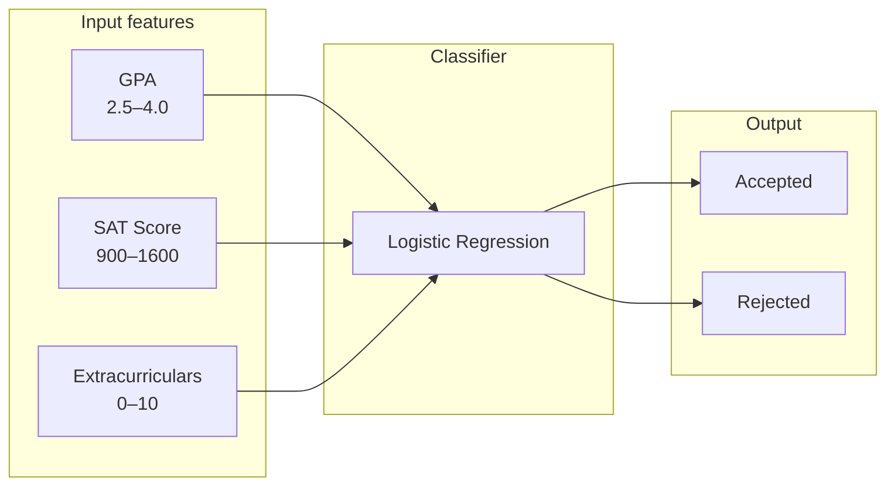

# Admissions Classifier

Group project for an **AI Fundamentals** class. Binary classifier that predicts **Accepted** vs **Rejected** for college applications using the [Kaggle student admission dataset](https://www.kaggle.com/datasets/amanace/student-admission-dataset). Features: GPA, SAT score, extracurricular activities.

## How `admissions.py` works



## Project requirements

**Business scenario**: University/College Admissions would like an admissions pipeline from beginning to end.

- **Beginning**: A student comes to the university/college for an admission enquiry
- **End product**: A script which invokes a model that decides if student is accepted or rejected

---

## What’s in the repo

| File | Description |
|------|-------------|
| `admissions.py` | CLI script: train logistic regression or run interactive review. Uses `model.joblib` and `scaler.joblib`. |
| `admissions_classifier.ipynb` | Jupyter notebook: trains neural net, logistic regression, and random forest; compares on Kaggle and synthetic data; saves `model.keras` + `scaler.joblib`. |
| `student_admission_dataset.csv` | Training data (GPA, SAT_Score, Extracurricular_Activities, Admission_Status). From [Kaggle](https://www.kaggle.com/datasets/amanace/student-admission-dataset). |
| `requirements.txt` | Python dependencies. |
| `Admissions Classifier Presentation.pptx` | Project presentation slides. |

**Note**: The script and notebook save different artifacts. Use `admissions.py` → `model.joblib` for the CLI; use the notebook → `model.keras` for neural net predictions.

---

## Kaggle dataset

[Kaggle Student Admission Dataset](https://www.kaggle.com/datasets/amanace/student-admission-dataset) — 250 applicants, 3 features, binary outcome.

```
┌─────────────────────────────────────┬──────────────────────────────────────────────────┐
│  Feature                            │  Range / values                                   │
├─────────────────────────────────────┼──────────────────────────────────────────────────┤
│  GPA                                │  2.5 – 4.0  (mean 3.24)                           │
│  SAT_Score                          │  900 – 1598  (mean 1250)                         │
│  Extracurricular_Activities         │  0 – 10  (mean 5.2)                               │
│  Admission_Status (target)           │  Accepted (81) | Rejected (81) | Waitlisted (88)  │
└─────────────────────────────────────┴──────────────────────────────────────────────────┘
```



---

## How to train

### Option A: Colab notebook (no local setup)

[](https://colab.research.google.com/github/adzuci/admissions-classifier/blob/main/admissions_classifier.ipynb)

Open the notebook in Google Colab. It fetches the dataset from GitHub. Run all cells to train NN, logistic regression, and random forest; evaluate; and predict. Works on Colab, Windows, and Mac.

### Option B: Script (local)

**1. Install**

```bash
pip install -r requirements.txt
```

**2. Get training data from Kaggle**

Create a [Kaggle account](https://www.kaggle.com) and set up API credentials:

1. Go to Kaggle → Account → Create New API Token (downloads `kaggle.json`)
2. Place `kaggle.json` in `~/.kaggle/` (Linux/Mac) or `C:\Users\<user>\.kaggle\` (Windows)
3. Run: `chmod 600 ~/.kaggle/kaggle.json`

Download the dataset:

```bash
kaggle datasets download -d amanace/student-admission-dataset
unzip student-admission-dataset.zip
```

**3. Train**

```bash
python admissions.py --train student_admission_dataset.csv
```

Or with default path: `python admissions.py --train`

Saves `model.joblib` and `scaler.joblib`.

**4. Review applications interactively**

```bash
python admissions.py
```

Prompts for GPA, SAT score, and extracurricular activities; prints ACCEPTED or REJECTED; offers to review another.

---

## What we learned

- **Small datasets favor simpler models**: On the Kaggle data (~250 samples), logistic regression (≈65%) outperformed both the neural net (~61%) and random forest (~63%). Neural nets typically need more data to shine.
- **Synthetic data changes the picture**: With 500 synthetic samples and a clear weighted rule, the notebook shows whether neural nets close the gap or beat simpler models.
- **Why logistic regression for the CLI**: Interpretable coefficients, minimal compute, and probability scores useful for waitlist thresholds. Best accuracy on the small real dataset.
- **EDA insights**: Extracurriculars shift the admission threshold; strong SAT can offset lower GPA.

---

## Future roadmap

| Area | Plan |
|------|------|
| **Hosting** | Azure or AWS — deploy model as a cloud-hosted API |
| **Data** | More features, larger training dataset |
| **UI/UX** | Streamlit dashboard for interactive prediction and visualizations |
| **CI/CD** | Automate retraining when the dataset updates |
| **Input validation** | Validate GPA (2–4), SAT (400–1600), extracurriculars (0–20) in `admissions.py` before prediction |
| **Batch capability** | Add `--batch` mode to `admissions.py` to score a CSV of applicants and write predictions to a file |
