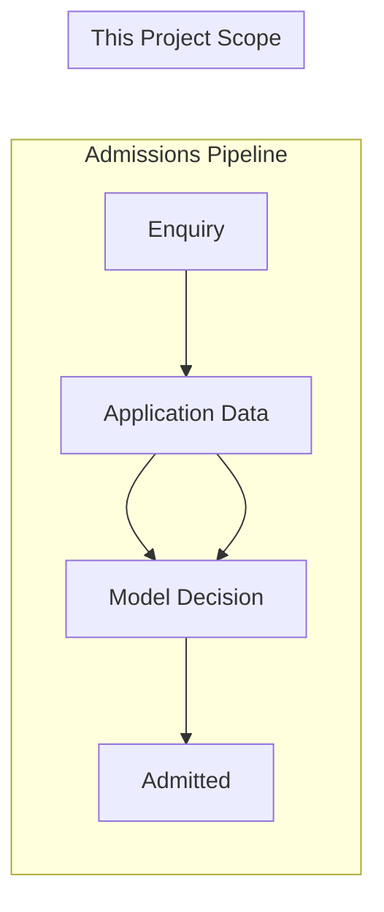

# University Admissions Pipeline – Minimal Class Project

## Business Scenario Mapping




Your scenario: **Beginning (Enquiry) → End (Admitted)**. For a **minimal** project, we focus on the **Application Data → Decision** step: train a classifier that predicts whether an applicant should be **Admitted** based on their profile.

---

## Repo Materials to Use


| Class / Notebook                                                                                                                                                                       | Use                                                                                        |
| -------------------------------------------------------------------------------------------------------------------------------------------------------------------------------------- | ------------------------------------------------------------------------------------------ |
| [class-2-machine-learning-basics/data-preprocessing.ipynb](class-2-machine-learning-basics/data-preprocessing.ipynb)                                                                   | DataFrame handling, missing values, scaling, train/test split                              |
| [class-5-deep-learning/02_class_5_student_grade_prediction.ipynb](class-5-deep-learning/02_class_5_student_grade_prediction.ipynb)                                                     | **Primary template**: binary classification (Pass/Fail → Admit/Reject) with neural network |
| [class-3-machine-learning-deep-learning-basics/02_class_3_logistic_regression_basics.ipynb](class-3-machine-learning-deep-learning-basics/02_class_3_logistic_regression_basics.ipynb) | Alternative: scikit-learn logistic regression for comparison                               |


The student grade prediction notebook is almost a direct fit: same structure (features in, binary outcome), same Keras workflow (Dense layers, sigmoid, binary cross-entropy). You swap the dataset and target column.

---

## Implementation Plan

### 1. Create project folder and notebook

- Folder: `class-7-computer-vision/` or a new `capstone-admissions/` at repo root
- Notebook: `admissions_classifier.ipynb`

If the course uses `capstone-admissions/` for mini projects, add it per the README schedule. Otherwise place in `class-7-computer-vision/` or alongside Class 5.

### 2. Data setup

- Download the [Kaggle student admission dataset](https://www.kaggle.com/datasets/amanace/student-admission-dataset) (requires Kaggle account)
- Typical structure: numeric features (e.g. GRE, TOEFL, GPA, research flag) and target `Admit` (0/1)
- Add a cell to load from a local path or from Kaggle API:
  ```python
  # Option A: Local (after downloading)
  df = pd.read_csv("Student_Admission.csv")

  # Option B: Kaggle API (pip install kaggle, credentials in ~/.kaggle/)
  # from Kaggle datasets download
  ```

### 3. Data preprocessing (from Class 2)

- Inspect: `df.head()`, `df.info()`, `df.describe()`
- Handle missing values: `fillna` or drop rows
- Separate features (`X`) and target (`y`); `y` = Admit column
- Train/test split: `train_test_split(X, y, test_size=0.2, random_state=42)`
- Scale features: `StandardScaler` fit on train, transform train and test

### 4. Model and training (from Class 5)

Adapt `02_class_5_student_grade_prediction.ipynb`:

- Input dimension: number of features (e.g. 7–8)
- Output: 1 neuron, sigmoid
- Loss: `binary_crossentropy`
- Epochs/batch_size as in the notebook
- Fit on `X_train`, `y_train`; validate on `X_test`, `y_test` (or a validation split)
- **Save model and scaler** for the review script: `model.save("model.keras")`, `pickle.dump(scaler, open("scaler.pkl", "wb"))`

### 5. Evaluation

- Predict on test set: `preds = (model.predict(X_test) > 0.5).astype(int)`
- Metrics: accuracy, confusion matrix, classification report (from scikit-learn)
- Add a short interpretation section tying results back to the admissions scenario

### 6. Optional: scikit-learn comparison (from Class 3)

- Train `LogisticRegression` on the same `X_train` / `y_train`
- Compare accuracy with the neural network
- Single extra cell; reinforces Class 3 material

### 7. Interactive review script (prompts, output, y/n loop)

Add `admissions_review.py` that prompts for applicant inputs, outputs the prediction, then asks if the user has another application to review:

```python
# admissions_review.py
import pickle
from tensorflow.keras.models import load_model

# Loads saved model + scaler (from notebook). Interactive loop:

def prompt_application(feature_names):
    """Prompt for each feature, return list of values."""
    values = []
    for name in feature_names:
        val = input(f"  {name}: ").strip()
        values.append(float(val))
    return values

def main():
    model = load_model("model.keras")  # or load from --model-path
    scaler = pickle.load(open("scaler.pkl", "rb"))
    
    while True:
        print("\n--- New application ---")
        values = prompt_application(["GRE", "TOEFL", "GPA", ...])  # match dataset columns
        X = scaler.transform([values])
        pred = (model.predict(X) > 0.5).astype(int)[0][0]
        result = "ADMIT" if pred == 1 else "REJECT"
        print(f"\n  Prediction: {result}\n")
        
        again = input("Another application to review? (y/n): ").strip().lower()
        if again != "y":
            print("Done.")
            break
```

- **Flow**: Load model + scaler → loop: prompt features → scale → predict → output Admit/Reject → ask "Another application to review? (y/n)" → exit if n
- **Prerequisite**: Model and scaler must be saved from the notebook (or a separate train script) before running the review script
- Optional `argparse`: `--model-path`, `--scaler-path` to override default paths

---

## File structure

```
capstone-admissions/           # or class-7-computer-vision/
├── admissions_classifier.ipynb
├── admissions_review.py       # interactive: prompt inputs, output, y/n loop
├── model.keras                 # generated: saved from notebook after training
├── scaler.pkl                 # generated: saved StandardScaler from notebook
├── Student_Admission.csv       # downloaded from Kaggle
└── README.md                  # brief project description and how to run
```

---

## Checklist

1. Clone repo, create `capstone-admissions/`
2. Download the Kaggle dataset
3. Create notebook with: env check, load data, preprocessing, model training, evaluation, **save model + scaler**
4. Create `admissions_review.py`: prompt for applicant features, output Admit/Reject, ask "Another application to review? (y/n)"
5. Run notebook to train and save; then run `python admissions_review.py` to review applications interactively
6. Add README with setup and usage

---

## Rollback

- New folder and notebook only; no changes to existing class materials
- Easy to remove if the project is no longer needed

